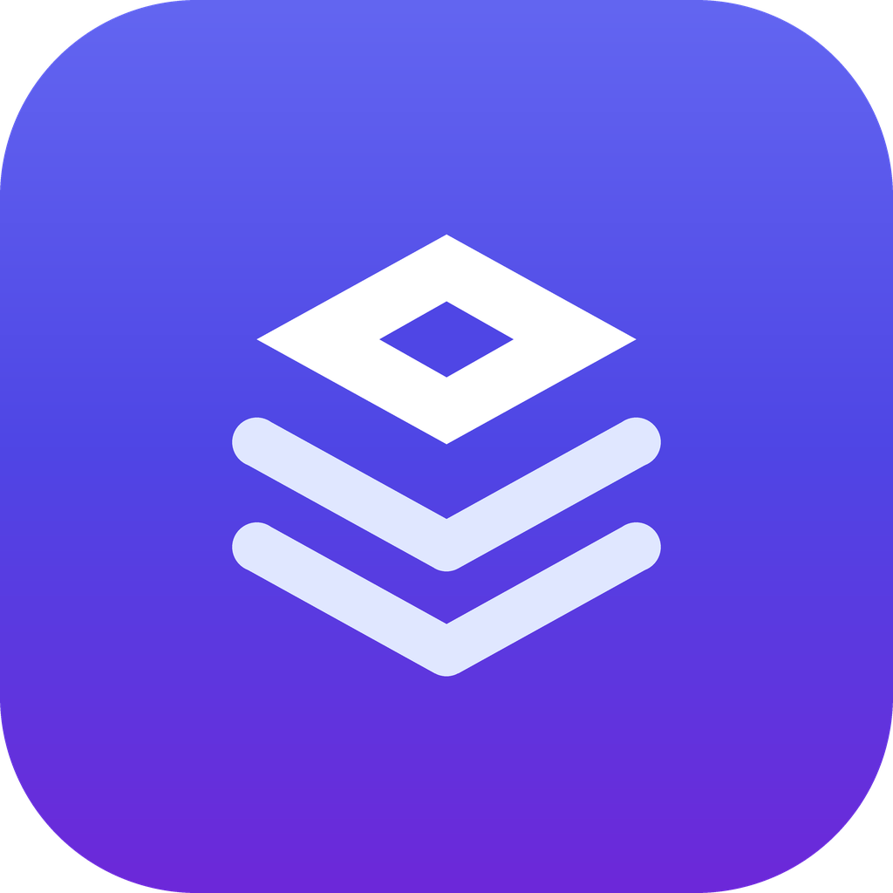
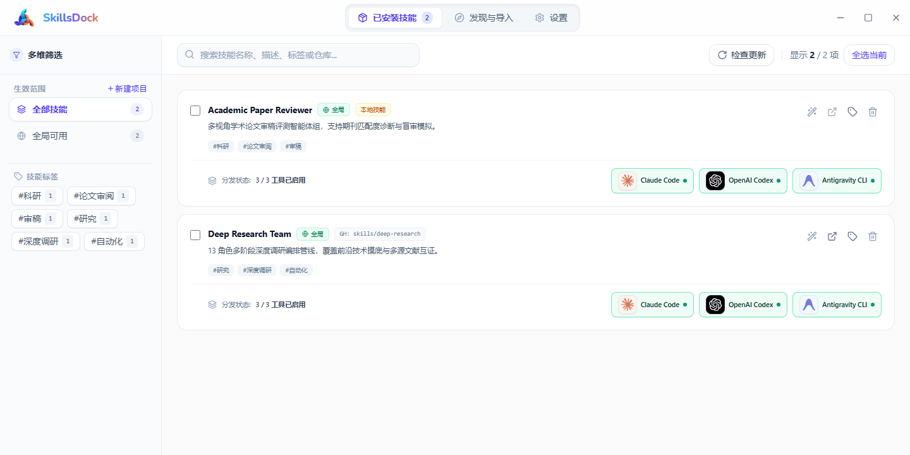
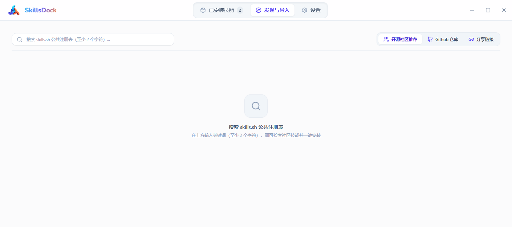
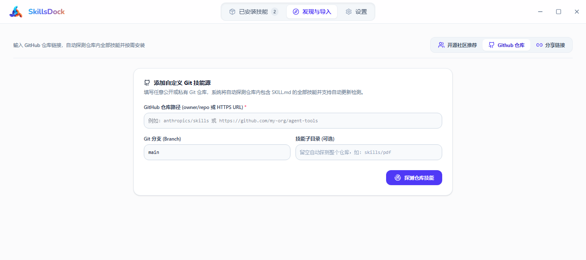

<div align="center">
  
  <h1>SkillDock</h1>
  <p><strong>One local skill library, managed once and distributed to every AI coding tool you use.</strong></p>
  <p><a href="./README.md">简体中文</a> · <a href="./README_EN.md">English</a></p>
  <p>
    <a href="https://github.com/Nightrail9/SkillsDock/releases/latest"></a>
    
    
    
  </p>
  <p>
    <a href="#download">Download</a> ·
    <a href="#core-features">Core features</a> ·
    <a href="#quick-start">Quick start</a> ·
    <a href="#development">Development</a>
  </p>
</div>



SkillDock is a cross-platform desktop app for managing AI agent skills. It consolidates skills scattered across different tool directories into one local library, then distributes them through file copies or symbolic links to Claude Code, OpenAI Codex, Antigravity CLI, OpenCode, OpenClaw, Hermes Agent, and custom tools.

Install once, update centrally, and enable each skill only where you need it.

## Why SkillDock

- **Stop maintaining duplicate files**: Keep every skill in one central library instead of copying it between tool directories by hand.
- **See deployment state at a glance**: Each skill card shows the tools where it is active and supports both individual and bulk operations.
- **Separate global and project skills**: Maintain a global collection while giving individual projects their own isolated skill sets.
- **Keep control of your data**: No account is required. The database, skill files, and settings remain on your machine.
- **Connect more tools**: In addition to the built-in adapters, any tool can be added by providing its name and skill directory.

## Core features

### Unified skill library

Installed and imported skills are stored in `~/.skilldock/skills/` by default. SkillDock manages their names, sources, tags, versions, scopes, and tool deployment state in one place.

### Discover and install from multiple sources

- Search the public [skills.sh](https://skills.sh/) registry
- Enter a GitHub repository and automatically discover skills containing `SKILL.md`
- Import from a local folder, URL, or ZIP archive
- Parse a SkillDock share link or bundle manifest and install its skills in a batch

#### skills.sh community search



#### GitHub repository import



### Distribute skills across tools

SkillDock supports both file copies and symbolic links. Symbolic links work natively on macOS and Linux. On Windows, use file copies or enable symbolic links by running with administrator privileges or turning on Developer Mode.

Built-in adapters:

| Tool | Default skill directory |
| --- | --- |
| Claude Code | `~/.claude/skills` |
| OpenAI Codex | `~/.codex/skills` |
| Antigravity CLI | `~/.gemini/config/skills` |
| OpenCode | `~/.opencode/skills` |
| OpenClaw | `~/.openclaw/skills` |
| Hermes Agent | `~/.hermes/skills` |

Every default path can be changed in Settings. You can also add custom tools with their own skill directories.

### Updates, tags, and bulk actions

- Track Git-based skill versions by commit and check for upstream updates
- Filter by name, description, tag, repository, and scope
- Enable, disable, update, tag, or uninstall several skills at once
- Generate a share link for one skill or a selected collection

### Project scope

Register a local project to install skills within that project scope and distribute them to the corresponding project-level directories for each tool. Project skills remain separate from global skills.

### Chinese and English interface

The interface supports Simplified Chinese and English. You can optionally configure an OpenAI Chat Completions-compatible endpoint to generate concise Chinese descriptions for installed skills. Model configuration is optional and does not affect local skill management.

## Download

Download the package for your platform from [GitHub Releases](https://github.com/Nightrail9/SkillsDock/releases/latest).

| Platform | Recommended file | Notes |
| --- | --- | --- |
| Windows 10 / 11 x64 | `SkillDock_*_x64-setup.exe` | Recommended for most users; installs WebView2 when needed |
| Windows enterprise deployment | `SkillDock_*_x64_en-US.msi` | Suitable for Group Policy, Intune, and silent deployment |
| Windows portable | `SkillDock-*-x64-green.zip` | Extract and run without installation |
| macOS 12+ | `SkillDock_*_x64.dmg` or `SkillDock_*_aarch64.dmg` | Choose x64 for Intel or aarch64 for Apple Silicon |
| Debian / Ubuntu | `SkillDock_*_amd64.deb` or `SkillDock_*_arm64.deb` | Choose the package matching your CPU architecture |
| Fedora / RHEL / openSUSE | `SkillDock-*.x86_64.rpm` or `SkillDock-*.aarch64.rpm` | Choose the package matching your CPU architecture |
| Other recent Linux distributions | `SkillDock_*_amd64.AppImage` or `SkillDock_*_aarch64.AppImage` | Portable single-file package |

> [!NOTE]
> Current macOS builds are unsigned. On first launch, right-click the app, select **Open**, and confirm that you want to run it.

> [!NOTE]
> Linux builds require WebKit2GTK 4.1, GTK3, and glibc 2.39 or newer. Ubuntu 24.04+, Debian 13+, Fedora 40+, or a comparable recent distribution is recommended.

## Quick start

1. Open **Discover & Import** and install a skill from skills.sh, GitHub, a local directory, a URL, or a ZIP archive.
2. Return to **Installed Skills** and use the tool buttons at the bottom of a skill card to distribute it.
3. Filter the library by tag or scope, or select several skills to run a bulk action.
4. For project-level isolation, register a project under **Settings → Projects**, then install skills into that project.
5. Under **Settings → General**, choose file copy or symbolic link distribution and change the central library location if needed.

## Data and privacy

SkillDock requires no account and uses no cloud database.

| Data | Default location |
| --- | --- |
| Central skill library | `~/.skilldock/skills/` |
| Local database | `~/.skilldock/skilldock.db` |
| Application data | `~/.skilldock/` |

Share links contain only the repository address and version information required to identify public skills. They do not include local paths or API keys. The optional model service API key is stored only on your machine.

> [!WARNING]
> Uninstalling a skill deletes its files from the central library. Automatic backups are not currently available. Keep uninstall confirmation enabled and back up important local skills yourself.

## Development

### Prerequisites

- Node.js 20.19+ or 22.12+
- Rust 1.85 or newer, installed through [rustup](https://rustup.rs/)
- The [Tauri 2 prerequisites](https://v2.tauri.app/start/prerequisites/) for your operating system

### Run locally

```bash
npm install
npm run tauri:dev
```

To run the browser preview only:

```bash
npm run dev
```

### Checks and tests

```bash
# TypeScript type checking
npm run lint

# Frontend production build
npm run build

# Rust backend tests
cd src-tauri
cargo test
```

### Build packages

```bash
# Build the packages configured for the current platform
npm run tauri:build

# Build Windows NSIS and MSI packages
npm run tauri:build -- --bundles nsis,msi
```

The Linux multi-architecture build scripts are in `src-tauri/docker/`. The macOS multi-architecture release workflow is in `.github/workflows/release-macos.yml`.

## Tech stack

- React 19, TypeScript, Vite 8, and Tailwind CSS 4
- TanStack Query
- Tauri 2 and Rust
- SQLite persistence through bundled `rusqlite`

## Acknowledgements

- [CC Switch](https://github.com/farion1231/cc-switch) provided an important implementation reference for cross-tool skill management.
- [Skills Manager](https://github.com/xingkongliang/skills-manager) provided product design references for a unified skill library and multi-tool distribution.

## License

The project metadata declares the [Apache License 2.0](https://www.apache.org/licenses/LICENSE-2.0).
